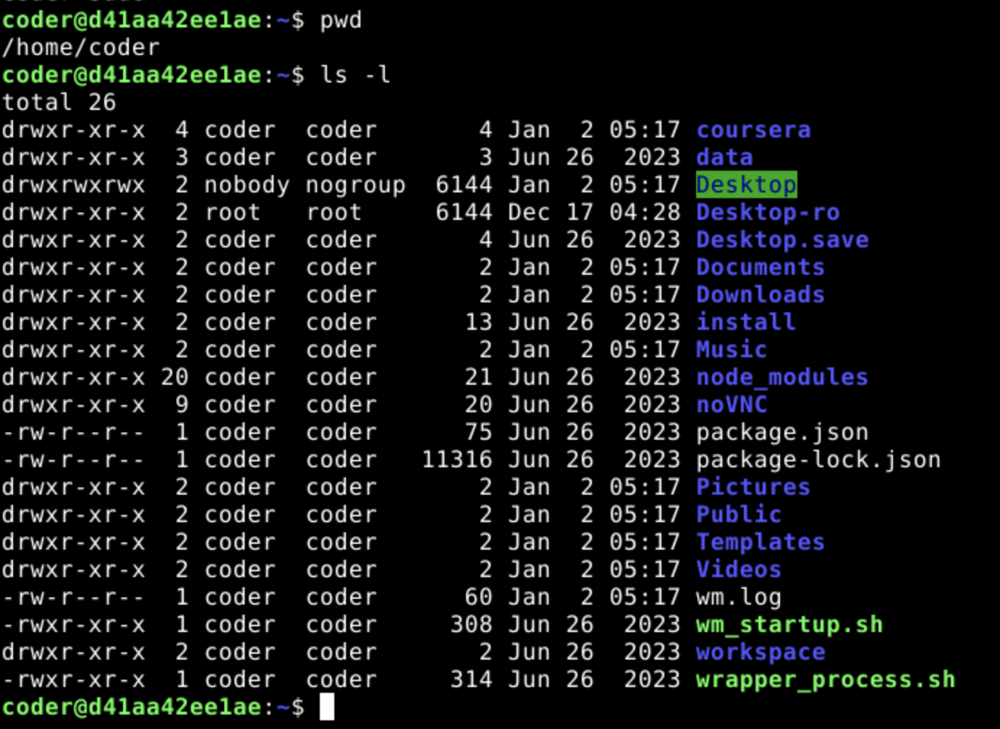
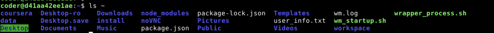
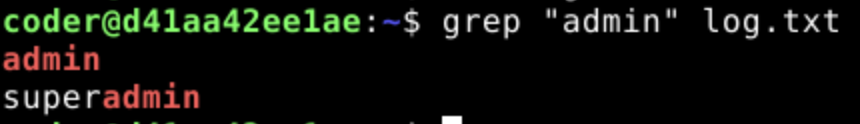

1. **Commands**
    - `whoami`
    - `groups`
   
   **Explanation**: `whoami` displays the username of the current user, while `groups` lists the groups to which the user belongs.

   **Output**:
   ```bash
   coder@d41aa42ee1ae:~$ whoami
   coder
   coder@d41aa42ee1ae:~$ groups
   coder sudo
   ```

   **Screenshot**:
   
2. **Commands**
    - `pwd`
    - `ls -l`

   **Explanation**: `pwd` displays the current working directory, while `ls -l` lists the contents of the directory in long format (includes permissions, size, and modification time).

   **Output**:
   ```bash
   coder@d41aa42ee1ae:~$ pwd
   /home/coder
   coder@d41aa42ee1ae:~$ ls -l
   total 26
   drwxr-xr-x 4 coder coder    4 Jan 2 05:17 coursera
   drwxr-xr-x 3 coder coder    3 Jun 26 2023 data
   drwxrwxrwx 2 nobody nogroup 6144 Jan 2 05:17 Desktop
   drwxr-xr-x 2 root root 6144 Dec 17 04:28 Desktop-ro
   drwxr-xr-x 2 coder coder 4 Jun 26 2023 Desktop.save
   drwxr-xr-x 2 coder coder 2 Jan 2 05:17 Documents
   drwxr-xr-x 2 coder coder 2 Jan 2 05:17 Downloads
   drwxr-xr-x 2 coder coder 13 Jun 26 2023 install
   drwxr-xr-x 2 coder coder 2 Jan 2 05:17 Music
   drwxr-xr-x 20 coder coder 21 Jun 26 2023 node_modules
   drwxr-xr-x 9 coder coder 20 Jun 26 2023 noVNC
   -rw-r--r-- 1 coder coder 75 Jun 26 2023 package.json
   -rw-r--r-- 1 coder coder 11316 Jun 26 2023 package-lock.json
   drwxr-xr-x 2 coder coder 2 Jan 2 05:17 Pictures
   drwxr-xr-x 2 coder coder 2 Jan 2 05:17 Public
   drwxr-xr-x 2 coder coder 2 Jan 2 05:17 Templates
   drwxr-xr-x 2 coder coder 2 Jan 2 05:17 Videos
   -rw-r--r-- 1 coder coder 60 Jan 2 05:17 wm.log
   -rwxr-xr-x 1 coder coder 308 Jun 26 2023 wm_startup.sh
   drwxr-xr-x 2 coder coder 2 Jun 26 2023 workspace
   -rwxr-xr-x 1 coder coder 314 Jun 26 2023 wrapper_process.sh
   ```

   **Screenshot**:
   
3. **Commands**
    - `echo "Linux user environment verified" > user_info.txt`

   **Explanation**: This command creates `user_info.txt` and writes the specified string to it; the `>` operator redirects the text into the file, overwriting any previous content.

   **Output**:
   ```bash
   coder@d41aa42ee1ae:~$ echo "Linux user environment verified" > user_info.txt
   coder@d41aa42ee1ae:~$ cat user_info.txt
   Linux user environment verified
   ```

   **Screenshot**:
   
4. **Commands**
    - `wc -m user_info.txt`

   **Explanation**: The `wc` command with the `-m` option counts the number of characters present in the file.

   **Output**:
   ```bash
   coder@d41aa42ee1ae:~$ wc -c user_info.txt
   32 user_info.txt
   ```

   **Screenshot**:
   
5. **Commands**
    - `man mkdir`

   **Explanation**: This opens the manual for the `mkdir` command. A useful option is `-p`, which allows the creation of parent directories as needed.

   **Output**:
   ```
   MKDIR(1) General Commands Manual MKDIR(1)
   NAME
        mkdir - make directories
   SYNOPSIS
        mkdir [-pv] [-m mode] directory_name ...
   DESCRIPTION
        The mkdir utility creates the directories named as operands, in the order specified, using mode "rwxrwxrwx" (0777) as modified by the current umask(2).
   
        The options are as follows:
   
        -m mode     Set the file permission bits of the final created directory to the specified mode. The mode argument can be in any of the formats specified to the chmod(1) command. If a symbolic mode is specified, the operation characters '+' and '-' are interpreted relative to an initial mode of "a=rwx".
   
        -p          Create intermediate directories as required. If this option is not specified, the full path prefix of each operand must already exist. On the other hand, with this option specified, no error will be reported if a directory given as an operand already exists. Intermediate directories are created with permission bits of "rwxrwxrwx" (0777) as modified by the current umask, plus write and search permission for the owner.
   
        -v          Be verbose when creating directories, listing them as they are created.
   ```

   **Screenshot**:
   
6. **Commands**
    - `ls ~`

   **Explanation**: This lists the contents of the home directory (represented by `~`), which the `ls` command sorts alphabetically by default.

   **Output**:
   ```bash
   coder@d41aa42ee1ae:~$ ls ~
   coursera Desktop-ro    Downloads  node_modules       package-lock.json  Templates      wm.log              wrapper_process.sh
   data     Desktop.save  install    noVNC              Pictures           user_info.txt  wm_startup.sh
   Desktop  Documents     Music      package.json       Public             Videos         workspace
   ```

   **Screenshot**:
   
7. **Commands**
    - `grep "admin" log.txt`

   **Explanation**: The `grep` command searches for the specific string "admin" inside `log.txt` and displays only the lines that match.

   **Output**:
   ```bash
   coder@d41aa42ee1ae:~$ grep "admin" log.txt
   admin
   superadmin
   ```

   **Screenshot**:
   
8. **Commands**
    - `uname -r`

   **Explanation**: The `uname` command with the `-r` flag displays the specific release version of the running Linux kernel.

   **Output**:
   ```bash
   coder@a2376d82877a:~$ uname -r
   6.5.0-1024-aws
   ```

   **Screenshot**:
   
9. **Commands**
    - `ping -c 4 www.google.com`

   **Explanation**: This sends 4 ICMP echo request packets to the specified URL to verify if the network connection is active.

   **Output**:
   ```bash
   coder@a2376d82877a:~$ ping -c 4 www.google.com
   PING www.google.com (64.233.180.105) 56(84) bytes of data.
   From ip-172-18-0-1.ec2.internal (172.18.0.1) icmp_seq=1 Destination Port Unreachable
   From ip-172-18-0-1.ec2.internal (172.18.0.1) icmp_seq=2 Destination Port Unreachable
   From ip-172-18-0-1.ec2.internal (172.18.0.1) icmp_seq=3 Destination Port Unreachable
   From ip-172-18-0-1.ec2.internal (172.18.0.1) icmp_seq=4 Destination Port Unreachable
   
   --- www.google.com ping statistics ---
   4 packets transmitted, 0 received, +4 errors, 100% packet loss, time 3057ms
   ```

   **Screenshot**:
   
10. **Commands**
    - `uptime`

   **Explanation**: This displays the system uptime, including how long the system has been running, the number of active users, and the system load average.

   **Output**:
   ```bash
   coder@a2376d82877a:~$ uptime
   06:15:18 up 28 days, 23:48, 0 users, load average: 4.18, 3.62, 3.47
   ```

   **Screenshot**:
   
