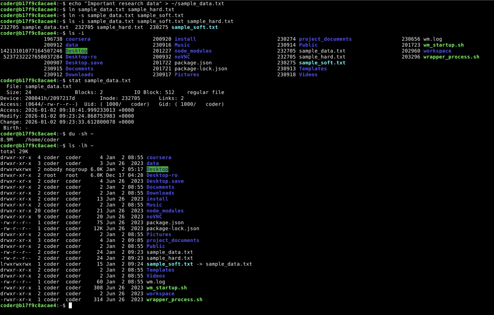
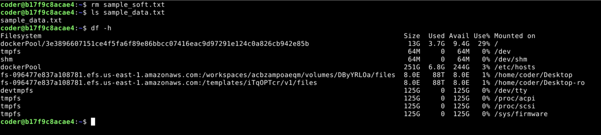
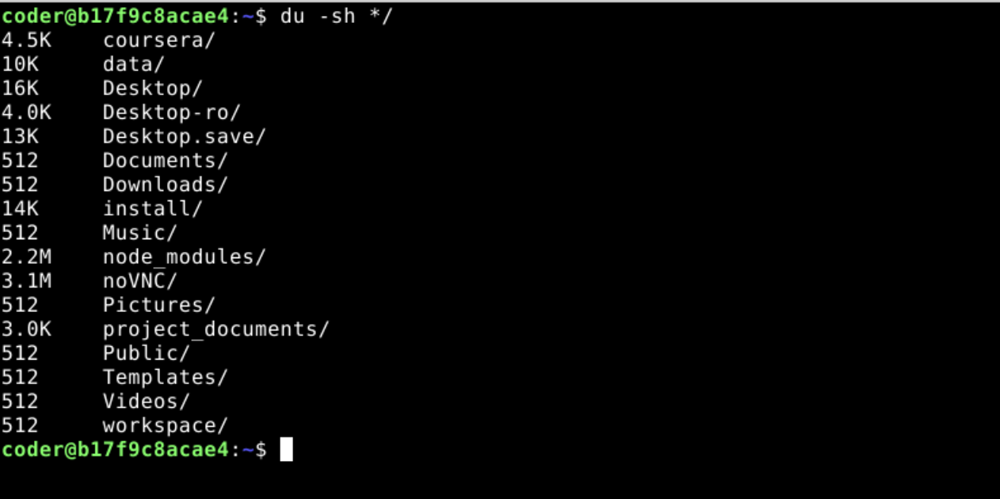

1. **Commands**
    - `echo "Important research data" > ~/sample_data.txt`

   **Explanation**: This creates a file named `sample_data.txt` in the home directory and populates it with sample text.

   **Screenshot**:
   
2. **Commands**
    - `ln ~/sample_data.txt ~/sample_hard.txt`

   **Explanation**: The `ln` command creates a hard link. A hard link is essentially a second name for the exact same physical data on the disk.
3. **Commands**
    - `ln -s ~/sample_data.txt ~/sample_soft.txt`

   **Explanation**: The `-s` flag creates a symbolic (soft) link. Unlike a hard link, this is a special file that acts as a shortcut or pointer to the original filename.

   **Screenshot**:
   
4. **Commands**
    - `ls -i sample_data.txt sample_hard.txt sample_soft.txt`

   **Explanation**: The `-i` flag instructs `ls` to display the inode number (the unique identifier for a file on the filesystem) next to each filename.

   **Output**:
   ```bash
   232705 sample_data.txt  232705 sample_hard.txt  230275 sample_soft.txt
   ```

   **Screenshot**:
   
5. **Commands**
    - `ls -i`

   **Explanation**: `sample_data.txt` and `sample_hard.txt` share the same inode because they point to the same data on the disk; `sample_soft.txt` has a unique inode because it is a separate pointer file.

   **Output**:
   ```bash
   196738 coursera            200920 install             230274 project_documents   230656 wm.log
   200912 data                200916 Music               230914 Public              201723 wm_startup.sh
   14213101077164507246 Desktop            201227 node_modules        232705 sample_data.txt     202960 workspace
   5237232227658037284 Desktop-ro         200932 noVNC               232705 sample_hard.txt     203296 wrapper_process.sh
   200907 Desktop.save        201722 package.json        230275 sample_soft.txt
   230915 Documents           201721 package-lock.json   230913 Templates
   230912 Downloads           230917 Pictures            230918 Videos
   ```

   **Screenshot**:
   
6. **Commands**
    - `stat sample_data.txt`

   **Explanation**: The `stat` command provides a detailed summary of a file's metadata, including permissions, UID/GID, size, and Access/Modify/Change timestamps.

   **Output**:
   ```bash
     File: sample_data.txt
     Size: 24              Blocks: 2          IO Block: 512    regular file
   Device: 200041h/2097217d    Inode: 232705      Links: 2
   Access: (0644/-rw-r--r--)  Uid: ( 1000/   coder)   Gid: ( 1000/   coder)
   Access: 2026-01-02 09:18:41.999233013 +0000
   Modify: 2026-01-02 09:23:24.868753983 +0000
   Change: 2026-01-02 09:23:33.612800078 +0000
    Birth: -
   ```

   **Screenshot**:
   
7. **Commands**
    - `du -sh ~`

   **Explanation**: `du` (disk usage) with `-s` (summary) and `-h` (human-readable) shows the total space consumed by your home directory in MB or GB.

   **Output**:
   ```bash
   8.9M    /home/coder
   ```

   **Screenshot**:
   
8. **Commands**
    - `ls -lh ~`

   **Explanation**: The `ls -lh` command lists the contents of your home directory with file sizes formatted in a human-readable way (e.g., K, M, G).

   **Output**:
   ```bash
   total 29K
   drwxr-xr-x  4 coder coder    4 Jan  2 08:55 coursera
   drwxr-xr-x  3 coder coder    3 Jun 26  2023 data
   drwxrwxrwx  2 nobody nogroup 6.0K Jan  2 05:17 Desktop
   drwxr-xr-x  2 root root     6.0K Dec 17 04:28 Desktop-ro
   drwxr-xr-x  4 coder coder    4 Jan 26  2023 Desktop.save
   drwxr-xr-x  2 coder coder    2 Jan  2 08:55 Documents
   drwxr-xr-x  2 coder coder    2 Jan  2 08:55 Downloads
   drwxr-xr-x  2 coder coder   13 Jun 26  2023 install
   drwxr-xr-x  2 coder coder    2 Jan  2 08:55 Music
   drwxr-xr-x 20 coder coder   21 Jun 26  2023 node_modules
   drwxr-xr-x  9 coder coder   20 Jun 26  2023 noVNC
   -rw-r--r--  1 coder coder   75 Jun 26  2023 package.json
   -rw-r--r--  1 coder coder  12K Jun 26  2023 package-lock.json
   drwxr-xr-x  2 coder coder    2 Jan  2 08:55 Pictures
   drwxr-xr-x  4 coder coder    4 Jan  2 09:05 project_documents
   drwxr-xr-x  2 coder coder    2 Jan  2 08:55 Public
   -rw-r--r--  2 coder coder   24 Jan  2 09:23 sample_data.txt
   -rw-r--r--  2 coder coder   24 Jan  2 09:23 sample_hard.txt
   lrwxrwxrwx  1 coder coder   15 Jan  2 09:24 sample_soft.txt -> sample_data.txt
   drwxr-xr-x  2 coder coder    2 Jan  2 08:55 Templates
   drwxr-xr-x  2 coder coder    2 Jan  2 08:55 Videos
   -rw-r--r--  1 coder coder   60 Jan  2 08:55 wm.log
   -rwxr-xr-x  1 coder coder  308 Jun 26  2023 wm_startup.sh
   drwxr-xr-x  2 coder coder    2 Jun 26  2023 workspace
   -rwxr-xr-x  1 coder coder  314 Jun 26  2023 wrapper_process.sh
   ```

   **Screenshot**:
   
9. **Commands**
    - `rm sample_soft.txt`
    - `ls sample_data.txt`

   **Explanation**: Removing a symbolic link only deletes the "shortcut" file; the original `sample_data.txt` remains perfectly intact.

   **Output**:
   ```bash
   sample_data.txt
   ```

   **Screenshot**:
   
10. **Commands**
    - `df -h`
    - `du -sh */`

   **Explanation**: `df -h` shows the available space on all mounted filesystems, while `du -sh */` lists the disk usage for subdirectories in the current path.

   **Output**:
   ```bash
   Filesystem                                                                              Size  Used Avail Use% Mounted on
   dockerPool/3e3896607151ce4f5fa6f89e86bbcc07416eac9d97291e124c0a826cb942e85b              13G  3.7G  9.4G  29% /
   tmpfs                                                                                    64M     0   64M   0% /dev
   shm                                                                                      64M     0   64M   0% /dev/shm
   dockerPool                                                                              251G  6.8G  244G   3% /etc/hosts
   fs-096477e837a108781.efs.us-east-1.amazonaws.com:/workspaces/acbzampoaeqm/volumes/DByYRL0a/files  8.0E   88T  8.0E   1% /home/coder/Desktop
   fs-096477e837a108781.efs.us-east-1.amazonaws.com:/templates/iTq0PTcr/v1/files                     8.0E   88T  8.0E   1% /home/coder/Desktop-ro
   devtmpfs                                                                                125G     0  125G   0% /dev/tty
   tmpfs                                                                                   125G     0  125G   0% /proc/acpi
   tmpfs                                                                                   125G     0  125G   0% /proc/scsi
   tmpfs                                                                                   125G     0  125G   0% /sys/firmware
   ```
   
   ```bash
   4.5K    coursera/
   10K     data/
   16K     Desktop/
   4.0K    Desktop-ro/
   13K     Desktop.save/
   512     Documents/
   512     Downloads/
   14K     install/
   512     Music/
   2.2M    node_modules/
   3.1M    noVNC/
   512     Pictures/
   3.0K    project_documents/
   512     Public/
   512     Templates/
   512     Videos/
   512     workspace/
   ```

   **Screenshot**:
   
   