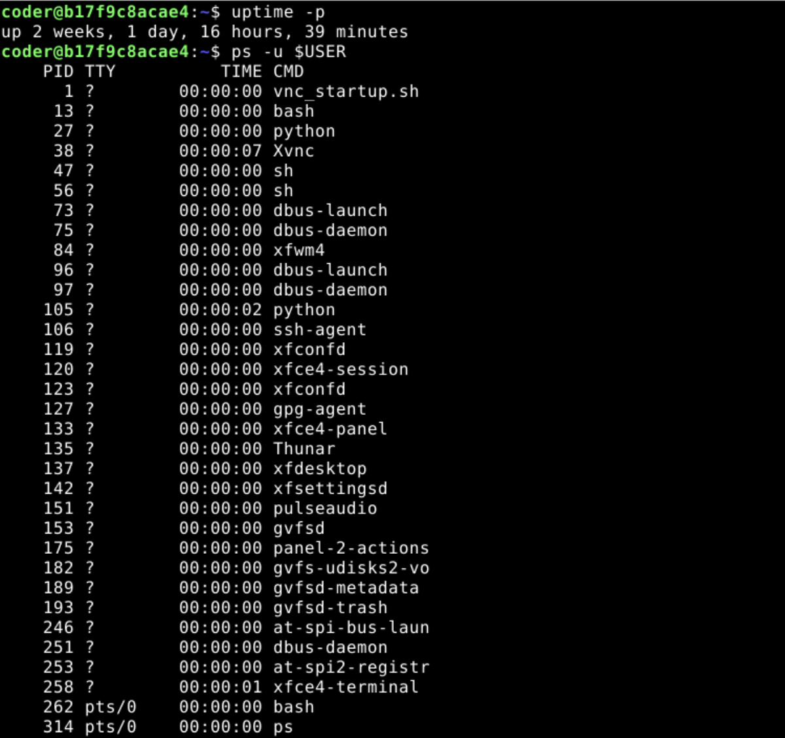

1. **Commands**
    - `uptime -p`

   **Explanation**: The `uptime` command with the `-p` (pretty) flag displays the system's up duration in a simple, easy-to-read format.

   **Output**:
   ```bash
   up 2 weeks, 1 day, 16 hours, 39 minutes
   ```

   **Screenshot**:
   
2. **Commands**
    - `ps -u $USER`

   **Explanation**: The `ps` command with the `-u` flag lists all active processes associated with your specific username.

   **Output**:
   ```bash
     PID TTY          TIME CMD
       1 ?        00:00:00 vnc_startup.sh
      13 ?        00:00:00 bash
      27 ?        00:00:00 python
      38 ?        00:00:07 Xvnc
      47 ?        00:00:00 sh
      56 ?        00:00:00 sh
      73 ?        00:00:00 dbus-launch
      75 ?        00:00:00 dbus-daemon
      84 ?        00:00:00 xfwm4
      96 ?        00:00:00 dbus-launch
      97 ?        00:00:00 dbus-daemon
     105 ?        00:00:02 python
     106 ?        00:00:00 ssh-agent
     119 ?        00:00:00 xfconfd
     120 ?        00:00:00 xfce4-session
     123 ?        00:00:00 xfconfd
     127 ?        00:00:00 gpg-agent
     133 ?        00:00:00 xfce4-panel
     135 ?        00:00:00 Thunar
     137 ?        00:00:00 xfdesktop
     142 ?        00:00:00 xfsettingsd
     151 ?        00:00:00 pulseaudio
     153 ?        00:00:00 gvfsd
     175 ?        00:00:00 panel-2-actions
     182 ?        00:00:00 gvfs-udisks2-vo
     189 ?        00:00:00 gvfsd-metadata
     193 ?        00:00:00 gvfsd-trash
     246 ?        00:00:00 at-spi-bus-laun
     251 ?        00:00:00 dbus-daemon
     253 ?        00:00:00 at-spi2-registr
     258 ?        00:00:01 xfce4-terminal
     262 pts/0    00:00:00 bash
     314 pts/0    00:00:00 ps
   ```

   **Screenshot**:
   
3. **Commands**
    - `top -u $USER`

   **Explanation**: Running `top` filtered by your user allows you to see real-time resource usage; you can press `P` to sort by the highest CPU consumption.
4. **Commands**
    - `sleep 100 &`
    - `jobs`

   **Explanation**: Adding `&` to a command starts it in the background, and the `jobs` command verifies that the process is active in the background.
5. **Commands**
    - `renice +10 -p [PID]`

   **Explanation**: The `renice` command changes the priority (niceness) of an existing process; a higher value like `+10` gives the process lower priority, making it "nicer" to other tasks.
6. **Commands**
    - `free -h`

   **Explanation**: The `free` command displays the total, used, and available physical and swap memory in human-readable units (e.g., GB or MB).
7. **Commands**
    - `df -h .`

   **Explanation**: Using `df -h` with a dot (`.`) targets only the filesystem associated with your current location (your home directory).
8. **Commands**
    - `echo $SHELL`

   **Explanation**: This command prints the value of the `$SHELL` environment variable, which stores the path to your current command-line interpreter (e.g., `/bin/bash`).
9. **Commands**
    - `lscpu > system_report.txt`

   **Explanation**: This command takes the detailed CPU architecture information and uses the `>` operator to save it into a file instead of printing it to the screen.
10. **Commands**
    - `ncdu ~`

   **Explanation**: `ncdu` is an interactive disk usage analyzer; it provides a visual, navigable interface to see which folders and files are consuming the most space in your home directory.